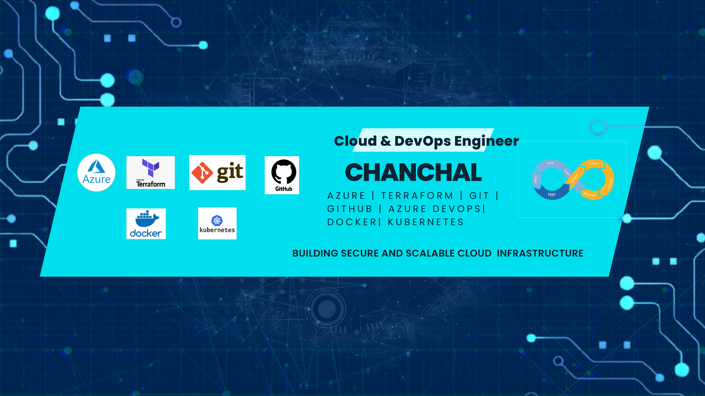

# Hi 👋, I'm Chanchal

### Cloud & DevOps Engineer

----

- ## 👋 About Me

Hi, I'm **Chanchal Raj**, a **Cloud & DevOps Engineer** passionate about building secure, scalable, and automated cloud infrastructure.

☁️ Hands-on experience with **Microsoft Azure** and cloud infrastructure deployment.

🏗️ Experienced in **Terraform** and Infrastructure as Code (IaC).

🔄 Working with **Azure DevOps, GitHub Actions, Git, and GitHub** for CI/CD and version control.

🐳 Familiar with **Docker, Kubernetes, and AKS** fundamentals.

🔐 Interested in **DevSecOps, cloud security, automation, and enterprise cloud architecture**.

🚀 Currently focused on strengthening my skills in **Azure, Terraform, CI/CD, and DevOps automation**.

## 🛠️ Skills & Technologies

  
  
  
  
  
  
  
  
  
  
  
  

## 🚀 Featured Projects

### ☁️ End-to-End DevSecOps Pipeline on Azure

Designed and deployed cloud infrastructure on Microsoft Azure using Terraform and automated application delivery through CI/CD.

**Technologies:**
`Azure` `Terraform` `GitHub Actions` `Docker` `DevSecOps`

**Highlights:**
- ⚙️ Provisioned Azure infrastructure using Terraform
- 🔄 Built CI/CD workflows using GitHub Actions
- 🐳 Integrated Docker containerization
- 🔐 Integrated security scanning into the CI/CD pipeline
- ⚡ Reduced deployment time through end-to-end automation

### 🏗️ Highly Available Azure Infrastructure

Designed highly available Azure infrastructure using Virtual Machines and Load Balancer for scalable application workloads.

**Technologies:**
`Azure` `Virtual Machines` `Load Balancer` `VNet` `Subnets` `NSGs`

**Highlights:**
- ☁️ Designed Azure Virtual Network architecture
- 🔐 Configured secure Subnets and NSGs
- ⚖️ Implemented Azure Load Balancer
- 📈 Designed infrastructure for horizontal scalability
- 🛡️ Focused on secure and highly available workloads

### ☸️ Containerized Microservice Deployment on Kubernetes

Deployed and managed containerized workloads on Azure Kubernetes Service (AKS).

**Technologies:**
`Docker` `Kubernetes` `AKS` `Azure` `CI/CD`

**Highlights:**
- 🐳 Created Docker images for application services
- ☸️ Deployed workloads on AKS
- 🔄 Managed Kubernetes Pods, Services and Deployments
- 🚀 Integrated containers with CI/CD workflows
- 📦 Automated application rollout

## 🔥 GitHub Streak

  

## 💻 Most Used Languages

  

## 📫 Connect With Me

- 📧 Email:  chanchal18041997@gmail.com
- 💼 LinkedIn: linkedin.com/in/chanchal-raj-6a1a923b7
- 💻 GitHub: https://github.com/chanchal7567

  
  
  

